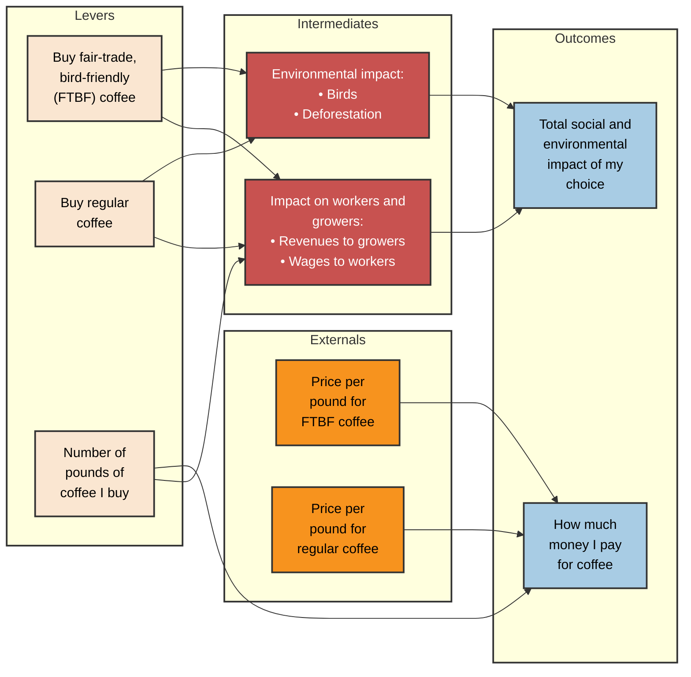

# Causal Decision Diagram: What Coffee to Buy

This Causal Decision Diagram (CDD) replicates the structure provided in the example image, illustrating the causal chains from actions (levers) and outside factors (externals) to the final goals (outcomes).

